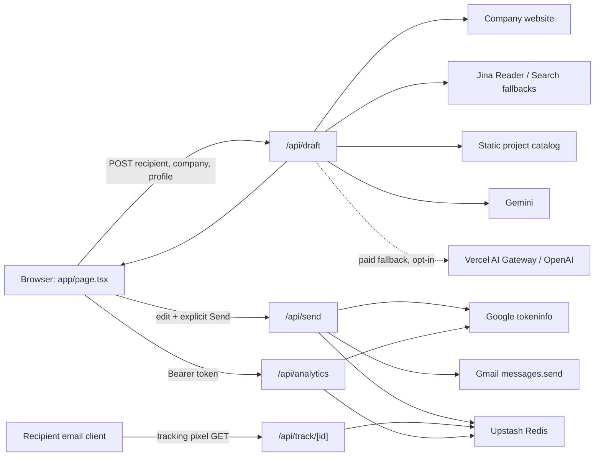
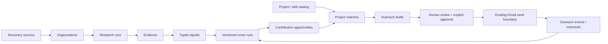

# EmailAutomator Architecture Audit

Audit date: 2026-08-11
Repository: `akshhkaushik/EmailAutomator`
Audited revision: `6d7fecb` (`master`, matching `origin/master` at audit time)

## Executive summary

EmailAutomator is a compact, single-user Next.js application that already has a useful end-to-end outreach loop: it researches a supplied company site, ranks a static catalog of Aksh's projects, drafts an editable email, requires an explicit send click and résumé attachment, sends through Gmail, and records approximate open events in Redis.

The safest evolution is not a rewrite. Keep the current UI, Gmail send path, Markdown/MIME rendering, project catalog, and open-tracking path. Extract the research, matching, generation, and composition logic from the monolithic draft route into independently testable services, then add a durable relational domain model for startups, evidence, signals, opportunities, scores, drafts, approvals, and outcomes.

Four issues should be addressed before broad discovery is enabled:

1. `/api/draft` is unauthenticated and can consume research and AI-provider resources.
2. URL validation rejects several obvious private IPv4 literals but does not validate resolved IP addresses or cover all internal/link-local IPv4 and IPv6 ranges, leaving an SSRF boundary gap.
3. Research facts are stored as unstructured strings without source URL, retrieval time, excerpt, or confidence, so claims cannot be audited or refreshed reliably.
4. `app/api/draft/route.ts` combines fetching, extraction, ranking, provider orchestration, fallback drafting, and email composition in one 902-line route.

No emails were sent and no production services were called during this audit.

## Current architecture

### Frontend architecture

- Framework: Next.js App Router with React 19 and TypeScript.
- Main surface: `app/page.tsx` is a single client component containing compose, review, Gmail connection, and analytics views.
- Layout and metadata: `app/layout.tsx`; metadata is generated per request from forwarded host/protocol headers.
- Styling: `app/globals.css` with Tailwind CSS imported for processing, but the UI itself primarily uses handwritten global class rules.
- Rendering: `lib/markdown.ts` converts the limited supported Markdown subset to escaped HTML and plain text. The preview uses `dangerouslySetInnerHTML`, but only after `escapeHtml`, with links and bold reconstructed from a constrained syntax.
- State: React component state plus browser `localStorage`. There is no frontend state-management library.
- Browser persistence:
  - `signal-profile`: personal profile and draft instructions.
  - `signal-compose-v1`: recipient/company inputs, generated draft, edited subject/body, and tracking preference.
  - `signal-gmail-autoconnect`: connection preference.
  - `signal-gmail-token-v1`: short-lived access token and expiry.
  - The résumé is deliberately not persisted.
- The UI has one explicit send control in the review panel. Draft generation alone cannot send an email.

### Backend and API architecture

All backend behavior uses Next.js route handlers:

| Route | Method | Responsibility | Authentication |
| --- | --- | --- | --- |
| `app/api/config/route.ts` | GET | Returns the public Google OAuth client ID | None; value is public by design |
| `app/api/draft/route.ts` | POST | Resolves/fetches company pages, extracts research, ranks projects, calls AI providers or local fallback, and composes a draft | None |
| `app/api/send/route.ts` | POST | Verifies Google identity, validates the email/attachment, prepares tracking, builds MIME, and calls Gmail | Google access token |
| `app/api/analytics/route.ts` | GET | Verifies Google identity, reads sender-scoped records, and computes aggregate metrics | Google access token |
| `app/api/track/[id]/route.ts` | GET | Records an observed image load and returns a transparent GIF | Opaque UUID in URL; intentionally public |

`app/api/draft/route.ts` exports `maxDuration = 60`; the browser aborts draft generation after 55 seconds.

### Database and storage

There is no relational database and no schema/migration system in tracked source.

- `lib/tracking.ts` uses `@upstash/redis` through Upstash REST variables, with Vercel KV-compatible aliases.
- Each email is stored for one year at `signal:outreach:<uuid>` as a JSON `TrackingRecord`.
- Each sender has a sorted-set index at `signal:sender:<lowercase-email>:emails`, scored by send time.
- Analytics returns at most the latest 100 indexed sent records.
- Open history is capped at 25 events per email, while `openCount` continues increasing.
- Profile, compose state, and the Gmail access token are device-local in `localStorage`; they are not server records.
- `.openai/hosting.json` declares neither D1 nor R2 (`d1: null`, `r2: null`).

### Authentication and authorization

- Gmail connection uses Google Identity Services loaded in `app/page.tsx`.
- Requested scopes are `openid`, `email`, and `https://www.googleapis.com/auth/gmail.send`.
- The browser sends the Google access token as a Bearer token to `/api/send` and `/api/analytics`.
- `lib/tracking.ts::verifyGoogleAccessToken` calls Google's token-info endpoint, requires a verified email, and checks the token audience only when `GOOGLE_CLIENT_ID` is configured.
- Analytics isolation is by the verified Google email and its sender-specific Redis index.
- There is no application session, user table, account allowlist, role model, CSRF token, or rate limiter. A valid token proves a Google identity, but the backend does not separately enforce that the identity is Aksh's authorized personal account.
- `app/chatgpt-auth.ts` contains helpers for trusted ChatGPT-injected identity headers, sign-in, and sign-out paths, but nothing imports it. It is currently dead code and provides no protection to the application.

### Gmail integration and human approval

- `app/page.tsx::connectGmail` starts OAuth; `disconnectGmail` revokes the active token and clears browser state.
- `app/page.tsx::sendEmail` is called only by the review panel's explicit button and refuses to proceed without a Gmail token and résumé.
- `app/api/send/route.ts::POST` verifies identity, validates headers/body/attachment size, disables tracking for self-tests, and calls Gmail's `users/me/messages/send` endpoint.
- `utf8Base64`, `base64Url`, `markdownToPlain`, and `markdownToHtml` build a multipart plain-text/HTML message with the résumé attachment.
- Tracking preparation occurs before Gmail send; failure removes the pending record. Successful sends finalize the record with the Gmail message ID.
- This explicit, single-recipient, edit-before-send safeguard must remain. Future automation should produce reviewable artifacts, never call the send route directly from discovery or scoring.

### AI and LLM integrations

Provider order in `app/api/draft/route.ts::POST`:

1. Direct Gemini, using at most two configured/default models and a strict JSON response schema.
2. Vercel AI Gateway, only when `ENABLE_PAID_AI_FALLBACKS=true`.
3. Direct OpenAI Responses API, only when paid fallbacks are enabled.
4. `researchedFallbackDraft`, a deterministic local fallback that does not call an LLM.

The route obtains Vercel OIDC through `@vercel/oidc` when paid fallbacks are enabled on Vercel and no static token is available. Model input is capped by compressed research/project selection, and output is capped at 1,200 tokens. Provider SDKs are not used; calls are direct `fetch` requests.

### Web research and search

The research implementation is polite and bounded per draft:

- `resolveCompanyUrl` uses the supplied website or infers a non-personal recipient domain.
- `normalizeUrl` permits HTTP(S) and blocks some loopback/private literal hosts.
- `safeFetch` uses browser-like headers, a six-second deadline, manual redirects, and at most four redirects.
- `fetchResearchPage` tries the public site first.
- `fetchWithReader` falls back to Jina Reader with image retention disabled and a 2,500-token request cap.
- `fetchSearchContext` is the final homepage fallback and submits a domain-restricted query to Jina Search.
- `researchLinks` selects at most three same-origin product/about/customer/career/blog-like links.
- The route fetches linked candidates concurrently and keeps at most four compacted source sections.
- `metadataFromHtml`, `researchTextFromHtml`, `researchSentences`, `sentenceScore`, and `compactResearch` perform extraction and heuristic compression.

Limitations: evidence returned to the browser is detached from its source URL; there is no crawl ledger, robots-policy handling, cache, freshness timestamp, content hash, canonicalization across runs, or structured signal extraction. Website text is also passed to a model without a strong explicit prompt-injection boundary.

### Email generation pipeline

- `validProjects` merges optional browser-supplied projects with the static researched catalog and validates URLs.
- `promptProjects` scores project/company word overlap plus a maturity boost and sends the top six to the model.
- The LLM schema permits at most two selected projects; returned title/live URL pairs are checked against the allowed catalog.
- `localContribution` provides a small domain-keyword-based opportunity when AI is unavailable.
- `composeEmail` deterministically assembles greeting, company introduction, observation, unique sender context, four fixed project examples, additional matches, one humble pitch, résumé note, and fixed signature.
- `contributionSubject` creates the fixed subject pattern.
- The browser receives research notes, contribution ideas, selected projects, subject, and body, then allows the recipient, subject, message, and tracking preference to be edited.

### Project catalog

`lib/personal-profile.ts` is a static, typed catalog of 28 `ResearchedProject` entries with title, description, live URL, repository URL, maturity, and startup relevance. It also defines `PERSONAL_RESEARCH_SUMMARY` and ten `STARTUP_CAPABILITIES`.

Catalog maturity distribution at audit time:

- 3 live
- 11 substantial
- 7 prototype
- 7 learning

This is one of the strongest reusable assets. It already distinguishes evidence quality, but it should eventually be persisted/versioned and given stable IDs, skills, evidence links, and last-verified timestamps. Four projects are additionally hardcoded as prose in `FIXED_PORTFOLIO_BLOCK`, creating a second source of truth for those descriptions and URLs.

### Analytics

- `createPendingTrackingRecord`, `markTrackingRecordSent`, and `removeTrackingRecord` implement a two-step send record lifecycle.
- `observeOpen` records first/latest timestamps, total count, and up to 25 user-agent events.
- `sameGoogleMailbox` normalizes Gmail dots, aliases, and `googlemail.com`; self-tests are excluded from metrics and tracking is disabled before send.
- `/api/analytics` computes sent, self-test, opened, unopened, open-rate, and total-load metrics at request time.
- The UI accurately labels opens as observed image loads and explains proxying, preloading, and image blocking.

There is no reply, bounce, interview, conversion, follow-up, or opportunity-level outcome model. Redis open updates are read-modify-write rather than atomic, so simultaneous loads can overwrite one another. Record TTL does not remove IDs from sender sorted sets, causing stale index members over time.

### Environment variables

No secret values were inspected or copied. `.env.local` is ignored by Git; only its variable names were inspected.

| Variable | Used by | Notes |
| --- | --- | --- |
| `GOOGLE_CLIENT_ID` | config, token verification | Primary public OAuth client ID; required for strict audience verification |
| `NEXT_PUBLIC_GOOGLE_CLIENT_ID` | config | Supported fallback but omitted from `.env.example`/README |
| `GEMINI_API_KEY` | draft | Enables direct Gemini |
| `GEMINI_LOW_COST_MODEL`, `GEMINI_MODELS`, `GEMINI_MODEL` | draft | Gemini order/configuration; `GEMINI_MODEL` is legacy |
| `ENABLE_PAID_AI_FALLBACKS` | draft | Gates Gateway and OpenAI usage |
| `AI_MODEL`, `AI_GATEWAY_API_KEY` | draft | Vercel AI Gateway model/auth |
| `OPENAI_API_KEY`, `OPENAI_MODEL` | draft | Direct OpenAI fallback |
| `JINA_API_KEY` | draft | Optional Reader/Search authorization |
| `UPSTASH_REDIS_REST_URL`, `UPSTASH_REDIS_REST_TOKEN` | tracking | Primary Redis REST configuration |
| `KV_REST_API_URL`, `KV_REST_API_TOKEN` | tracking | Supported Vercel KV-compatible aliases, omitted from `.env.example`/README |
| `VERCEL`, `VERCEL_OIDC_TOKEN` | draft | Platform-provided signals/tokens; not user configuration |

The local environment also contains provider-injected Redis/KV variable names that current source does not read (`KV_REST_API_READ_ONLY_TOKEN`, `KV_URL`, `REDIS_URL`). Their values were not inspected.

### Deployment configuration

- README documents Vercel deployment and Google OAuth origin setup.
- `.vercel/` contains ignored local link metadata for the `signal-personal-outreach` project; IDs were not copied into this audit.
- `.openai/hosting.json` also links a Sites project and declares no D1/R2 resources.
- `next.config.ts` has no custom runtime, image, header, redirect, or security configuration.
- There is no Dockerfile, infrastructure-as-code, GitHub Actions workflow, preview workflow, or checked-in deployment test.
- The application currently builds as a standard Next.js 16 app. The repository contains both Vercel and Sites linkage, so one authoritative production target and its persistence plan should be documented before adding a relational database.

### Testing infrastructure

- No unit, integration, end-to-end, fixture, or contract test files exist.
- `npm test` aliases `npm run build`; it is a compile/type/build gate, not a behavioral test suite.
- ESLint uses Next.js Core Web Vitals and TypeScript presets.
- TypeScript is strict and no-emit, but `skipLibCheck` and `allowJs` are enabled.
- No CI runs these checks automatically.

## Current data flow and exact ownership

### 1. User input

1. `app/page.tsx::Home` owns recipient email/name, company URL, résumé, profile, draft, subject/body, tracking preference, Gmail token, and status.
2. Profile and compose `useEffect` blocks restore and persist browser-local state.
3. `generateDraft` posts `{ companyUrl, recipientEmail, recipientName, profile }` to `/api/draft` with a 55-second abort.

### 2. Company research

1. `app/api/draft/route.ts::POST` validates recipient email.
2. `resolveCompanyUrl` and `normalizeUrl` select and validate the company URL.
3. `fetchResearchPage` calls `safeFetch`, then optionally `fetchWithReader` and `fetchSearchContext`.
4. `researchLinks` selects up to three relevant same-origin pages.
5. `researchTextFromHtml`, `metadataFromHtml`, `researchSentences`, `sentenceScore`, and `compactResearch` create the model-ready evidence text.
6. `companyNameFromResearch` and `cleanResearchEvidence` support deterministic fallback extraction.

### 3. Project matching

1. `lib/personal-profile.ts::RESEARCHED_PROJECTS` supplies the built-in catalog.
2. `app/api/draft/route.ts::validProjects` merges custom and built-in entries, validates URLs, deduplicates, and caps the catalog at 40.
3. `meaningfulWords` and `promptProjects` rank by token overlap and maturity, retaining six candidates.
4. The LLM selects at most two; the route accepts only exact title/live URL matches from the allowed map.
5. `researchedFallbackDraft` selects the top deterministic match when no valid AI output exists.

### 4. Email generation

1. `POST /api/draft` builds a strict JSON schema and provider request.
2. `extractGeminiText` or `extractOutputText` extracts provider output.
3. Invalid/missing output falls back to `researchedFallbackDraft`.
4. The focused outreach composer assembles the final editable Markdown body from a grounded observation, one concrete build idea, Aksh's portfolio and CV context, and one low-friction CTA.
5. `app/page.tsx::generateDraft` places the response into state and local storage.

### 5. Review and approval

1. `app/page.tsx` renders research evidence, opportunity ideas, and matched work.
2. `markdownToHtml` renders the preview; the recipient, subject, raw message, tracking choice, and résumé remain editable.
3. The review footer states that sending occurs only on button press.
4. `sendEmail` is invoked only by that explicit button and refuses to send without a résumé or Gmail connection.

### 6. Gmail send

1. `connectGmail` creates a Google token client and requests the minimum send-plus-identity scopes.
2. `sendEmail` base64-encodes the selected résumé and posts the reviewed fields to `/api/send`.
3. `app/api/send/route.ts::POST` calls `verifyGoogleAccessToken` and validates fields.
4. `markdownToPlain` and `markdownToHtml` create alternative MIME bodies; helper functions encode MIME headers/body.
5. The route calls Gmail `users/me/messages/send` once for the one recipient.

### 7. Tracking

1. Before Gmail send, `createPendingTrackingRecord` writes a pending Redis record when storage is available.
2. `/api/send` appends `/api/track/<uuid>` to the HTML only when tracking is enabled and the recipient is not the sender.
3. On Gmail success, `markTrackingRecordSent` stores the Gmail ID/time and indexes the record.
4. `app/api/track/[id]/route.ts::GET` calls `observeOpen` and always returns a transparent no-cache GIF.
5. `app/page.tsx::loadAnalytics` calls `/api/analytics` with the Gmail token.
6. `app/api/analytics/route.ts::GET` verifies identity, calls `listTrackingRecords`, classifies legacy self-tests, and computes metrics.
7. `AnalyticsView` renders aggregate and per-email observed-load history.

## Existing modules and reuse assessment

| Module | Current role | Reuse decision |
| --- | --- | --- |
| `app/page.tsx` | Single compose/review/analytics client | Keep UI behavior; split components only when new views require it |
| `app/api/draft/route.ts` | Entire research-to-draft orchestration | Keep behavior, extract stage services behind the same route contract |
| `app/api/send/route.ts` | Review-to-Gmail boundary | Keep and strengthen authorization/approval invariants |
| `app/api/analytics/route.ts` | Sender-scoped open analytics | Keep during migration; add richer outcomes separately |
| `app/api/track/[id]/route.ts` | Pixel event endpoint | Keep, make event updates atomic and define retention/index cleanup |
| `lib/personal-profile.ts` | Personal capabilities and 28-project catalog | Reuse as seed data and preserve maturity semantics |
| `lib/tracking.ts` | Redis records, identity verification, analytics reads | Reuse for existing tracking; do not make it the relational domain store |
| `lib/markdown.ts` | Safe limited Markdown, HTML, and plain-text conversion | Reuse for previews and MIME generation |
| `app/chatgpt-auth.ts` | Unused ChatGPT-host identity helpers | Remove only after a separate decision; do not treat as active auth |

## Dependency audit

### Declared direct dependencies

| Dependency | Purpose | Assessment |
| --- | --- | --- |
| `next`, `react`, `react-dom` | App Router framework and UI | Core, used |
| `@upstash/redis` | Durable tracking storage | Used only by `lib/tracking.ts` |
| `@vercel/oidc` | Runtime AI Gateway token | Used conditionally by draft provider fallback |
| `tailwindcss`, `@tailwindcss/postcss` | CSS processing/import | Used by PostCSS and `globals.css` |
| TypeScript/types | Static checking | Used |
| ESLint/Next ESLint config | Linting | Used |

No declared package is clearly unused. `app/chatgpt-auth.ts` is unused source code, not an unused dependency. Direct HTTP calls avoid additional provider SDK dependencies.

### Version and vulnerability findings

At audit time, `npm audit` reported four findings:

- High: `js-yaml@4.3.0`, dev-only through ESLint, quadratic CPU consumption advisory.
- High: `nanoid@3.3.16`, transitive through PostCSS.
- Moderate: vulnerable `postcss@8.5.18` nested under Next.
- A second moderate count is included in the Next/PostCSS advisory dependency chain.

The package override explicitly pins Next's nested PostCSS to `8.5.18`, which is inside the audited vulnerable range. The override also pins Sharp. These overrides should be explained or removed only after compatibility validation; no dependency was upgraded during Phase 0.

`npm outdated` showed small available updates for Upstash, Vercel OIDC, Next, React, and React DOM. No direct dependency emitted a deprecation warning during clean installation. Two extraneous WASM/Sharp packages appeared in `npm ls` after install; they are installation artifacts rather than declared application dependencies.

### Duplicated functionality and definitions

- `Project`, `Draft`, `OpenEvent`, `TrackedEmail`, and related response shapes are redeclared in the client instead of shared or runtime-validated.
- Fixed project descriptions/URLs exist both in `FIXED_PORTFOLIO_BLOCK` and `RESEARCHED_PROJECTS`.
- Profile fields `name`, `portfolio`, and `linkedin` are stored but not used by draft composition; the actual signature is hardcoded separately.
- Provider calls implement similar timeout/error/extraction flows three times.
- Research, opportunity inference, project matching, and presentation composition are coupled in one route.

### Security and reliability concerns

- P0: incomplete SSRF defense in user-directed server fetching. Literal filtering is not equivalent to DNS-resolution and redirect-target validation.
- P0: unauthenticated, unrate-limited `/api/draft` can consume Jina/Gemini/paid-provider quota and server time.
- P1: Gmail tokens are persisted in `localStorage`, increasing impact of any future XSS. They are short-lived and revocable, which reduces but does not remove the risk.
- P1: token audience validation is skipped when `GOOGLE_CLIENT_ID` is absent; production startup/config validation should make the invariant mandatory for authenticated routes. The personal application also lacks a sender-email allowlist.
- P1: researched page content can contain prompt-injection instructions; source content should be explicitly delimited and treated only as untrusted evidence.
- P1: AI JSON is parsed but not runtime-validated after parsing. Some malformed shapes can throw or pass weak semantic checks.
- P1: open-event writes are non-atomic and sender indexes have no retention cleanup.
- P1: there is no request-rate limit, bounded research-response body reader, request body-size middleware, audit log for approvals, or durable approval version binding.
- P2: errors from the draft route are generally returned as HTTP 400 even for upstream failures, making operations/alerting harder.
- P2: outbound fetches have bounds but no shared retry/backoff, cache, or per-domain politeness ledger.
- P2: tracking records contain personal data for one year without an in-app delete/export control.

## Data model audit

### Existing structures

| Structure | Location | Persistence | Fields/purpose |
| --- | --- | --- | --- |
| `Profile` | `app/page.tsx`, draft route | Browser | Sender identity/context, optional projects, template |
| `Project` | `app/page.tsx` | Browser if supplied | ID/title/description/live/repository URLs |
| `ResearchedProject` | `lib/personal-profile.ts` | Source code | Project evidence, maturity, startup value |
| `Draft` | `app/page.tsx` | Browser | Company summary/evidence/ideas/projects plus subject/body/source |
| AI output schema | draft route | Request-local | Company, evidence, ideas, highlight terms, matches, observation, sender work, pitch |
| `SavedCompose` | `app/page.tsx` | Browser | Current target, draft, edits, tracking preference |
| `CachedGmailToken` | `app/page.tsx` | Browser | Access token and expiry |
| `TrackingRecord` | `lib/tracking.ts` | Redis | Sender/recipient/company/subject/Gmail ID/status/tracking/timestamps/opens |
| `OpenEvent` | client/tracking library | Redis | Observed timestamp and user agent |
| `Analytics` | `app/page.tsx` | Request-local | Computed stats and tracking records |

### Reuse by future entity

| Future concept | Reusable seed | Required evolution |
| --- | --- | --- |
| Startups/companies | `Draft.companyName`, `companyUrl`, summary | One canonical `Organization`/`Startup` record, aliases/domains, accelerator relation, status, timestamps |
| Founders | Recipient name/email | New `Person` plus organization-role relation and evidence; do not equate every recipient with a founder |
| Projects | `ResearchedProject` | Stable ID, skills/capabilities, evidence URLs, maturity, last verification, optional persisted overrides |
| Research evidence | Draft evidence strings and compacted pages | First-class `Evidence` with source URL, retrieved/published time, excerpt, content hash, claim, confidence, and run ID |
| Signals | None beyond raw page text | New typed `Signal` linked to evidence: funding, hiring, launch, founder activity, team size, etc. |
| Contribution opportunities | `contributionIdeas`, `pitch`, `localContribution` | First-class opportunity with target user/problem, proposed contribution, evidence, status, effort, and project matches |
| Outreach | `Draft` plus `TrackingRecord` | Versioned draft, reviewed content hash, approval state/time, sender/recipient, opportunity link, provider/source |
| Email history | Gmail ID, subject, recipient/company, timestamps | Preserve reviewed body/version, send result, thread ID if later requested, follow-ups, replies/bounces/outcomes |
| Analytics | Open events and computed metrics | Append-only events and funnel outcomes linked to startup/opportunity/outreach; keep open caveats |

## Technical debt priorities

### P0 — blocks future architecture

1. Close the server-side fetch boundary: resolve and validate every destination/redirect against complete private, loopback, link-local, metadata, multicast, reserved, and IPv6 ranges; prevent DNS rebinding.
2. Put authenticated single-user authorization and rate/resource limits in front of research and any future discovery jobs.
3. Introduce first-class, source-linked research evidence and immutable research-run records before generating startup signals at scale.
4. Extract the draft route into reusable stages with explicit inputs/outputs: fetch, extract, evidence, project match, opportunity, generation, composition.
5. Choose one authoritative deployment/persistence target and introduce a durable relational store for the core domain; Redis/browser storage cannot represent the required relationships and learning history.

### P1 — fix before expansion

1. Add unit tests for URL safety, extraction, project ranking, fallback opportunities, composition, mailbox normalization, MIME generation, and tracking lifecycle; add route integration tests and CI.
2. Require configured Google client audience on send/analytics and reduce browser token exposure where the chosen hosting/auth model permits.
3. Add runtime schema validation and semantic grounding checks around model output; explicitly isolate untrusted source text from instructions.
4. Make open-event mutation atomic and expire/clean sender indexes consistently with records.
5. Create a versioned review/approval record bound to the exact subject/body/recipient/attachment metadata sent. Retain the existing explicit button.
6. Resolve audited dependency vulnerabilities with focused upgrades and remove/explain the vulnerable PostCSS override after compatibility testing.
7. Align `.env.example`, README, code-supported aliases, and production configuration validation.
8. Define retention, deletion, and export behavior for recipient/research/outreach data.

### P2 — cleanup

1. Share DTO/domain types between client and server where appropriate and validate at runtime at trust boundaries.
2. Split the large `Home` component as discovery/intelligence screens arrive; avoid premature component churn now.
3. Remove or deliberately integrate `app/chatgpt-auth.ts`.
4. Eliminate the fixed-project/profile/signature second sources of truth.
5. Remove unused stored profile fields or make composition honor them.
6. Return meaningful upstream/status classes and structured error codes.
7. Add research caching, freshness, canonical URLs, content hashes, and bounded per-domain retry/backoff.
8. Document Vercel versus Sites ownership and remove stale linkage only after the deployment decision.

### P3 — optional

1. Add richer provider observability, cost/token accounting, and per-stage latency dashboards.
2. Add a project-catalog editor and automated link freshness checks.
3. Replace handcrafted MIME generation with a proven mail composer only if current tests reveal compatibility gaps; avoid a dependency solely for abstraction.
4. Add richer analytics visualizations after reply/conversion data exists.

## Proposed target architecture

The minimum target is a modular monolith in the existing Next.js application, not microservices.

### Domain boundaries

1. **Discovery**: accelerator/source adapters produce candidate organization URLs and source records. Deduplicate; do not research or email inside adapters.
2. **Intelligence**: bounded fetch/extract produces immutable evidence, then typed signal extractors derive claims with evidence links.
3. **Scoring**: deterministic, versioned score components consume signals and Aksh preferences. LLM prose must not be the source of numeric truth.
4. **Contribution engine**: produces concrete, scoped opportunities and matches them to structured project/capability evidence.
5. **Outreach**: reuses `composeEmail`, Markdown/MIME conversion, review UI, Gmail authorization, and tracking. Draft generation remains separate from approval and send.
6. **Learning**: append-only events capture approval, send, open, reply, follow-up, interview, rejection, and user feedback; future scoring revisions train on explicit outcomes, not raw open counts alone.

### Minimum persistent entities

- `Source` / `Accelerator`
- `Organization` (startup/company is one canonical entity with classification)
- `OrganizationSource`
- `Person` and `OrganizationPersonRole`
- `ResearchRun`
- `Evidence`
- `Signal`
- `Project` and `Capability`
- `ContributionOpportunity`
- `ProjectMatch`
- `ScoreRun` and `ScoreComponent`
- `OutreachDraft`
- `OutreachApproval`
- `OutreachMessage`
- `OutreachEvent`

Every derived record should carry a schema/algorithm version, timestamps, and the IDs of the inputs that produced it. Evidence and sent content should be immutable; refreshes create new versions.

### Suggested module extraction

Names are illustrative and should be introduced incrementally:

- `lib/research/url-safety.ts`
- `lib/research/fetch.ts`
- `lib/research/extract.ts`
- `lib/research/evidence.ts`
- `lib/projects/catalog.ts`
- `lib/projects/match.ts`
- `lib/opportunities/generate.ts`
- `lib/ai/providers.ts`
- `lib/outreach/compose.ts`
- `lib/outreach/mime.ts`
- `lib/outreach/approval.ts`
- `lib/domain/*` for durable models/repositories

The current `/api/draft` response can remain compatible while its implementation delegates to these modules.

## Migration strategy

1. **Safety and characterization**: add tests around current behavior; secure URL fetching and route access; record representative deterministic fixtures without calling live providers.
2. **Extract without changing behavior**: move pure functions from the draft/send routes into modules and keep route/UI contracts unchanged.
3. **Add persistence alongside current state**: select the authoritative deployment datastore, create normalized entities, and seed the 28-project catalog. Keep Redis tracking and browser drafts working during transition.
4. **Persist research provenance**: write organization, research run, pages/evidence, and freshness before adding discovery sources.
5. **Add discovery adapters**: begin with manually configured accelerator feeds/pages and conservative schedules. Deduplicate before research.
6. **Add signal and score versions**: start deterministic and inspectable; expose component explanations in the UI.
7. **Promote contribution ideas into records**: link each opportunity to evidence and project matches, with explicit user accept/reject feedback.
8. **Integrate outreach**: prefill the existing compose/review experience from an approved opportunity. Never bypass the send button or résumé/user review requirements.
9. **Add outcomes and learning**: migrate/associate Redis tracking where possible, then capture richer manual and provider-supported outcomes.

Each step is additive and reversible. Do not remove the current compose flow until the equivalent path passes characterization and end-to-end tests.

## Risks

| Risk | Impact | Mitigation |
| --- | --- | --- |
| Automated discovery increases SSRF/quota exposure | Security/cost | Complete URL safety, auth, rate limits, budgets before Phase 1 |
| Weak provenance produces fabricated or stale signals | Bad ranking/outreach | Immutable source-linked evidence, freshness, confidence, human inspection |
| Model prompt injection from websites | Incorrect output/data leakage | Treat pages as untrusted data, delimiter policy, allowlisted tools, runtime/grounding validation |
| Scaling the monolithic route multiplies coupling | Slow/unsafe changes | Extract stage contracts behind current API before new features |
| Open loads are mistaken for intent | Bad learning signal | Preserve caveat; weight replies and explicit outcomes above opens |
| Two hosting linkages diverge | Deployment/storage inconsistency | Select and document one authoritative runtime before database work |
| Personal/recipient data retention grows | Privacy risk | Data minimization, retention controls, deletion/export, access isolation |
| Human approval erodes through automation | Accidental sends | Separate draft/approval/send states; exact-content approval binding; single-recipient send boundary |

## Recommended implementation order

1. Phase 0 follow-up hardening: tests, SSRF defense, authenticated/rate-limited research, runtime validation, dependency advisories.
2. Extract the existing pipeline into pure, tested modules without changing the UI/API contract.
3. Decide the authoritative deployment and relational datastore; add the domain schema and seed the project catalog.
4. Implement Phase 1 discovery with provenance and conservative scheduling.
5. Add intelligence/signals, then transparent scoring, then contribution opportunities.
6. Feed approved opportunities into the existing review-first Gmail flow.
7. Add build-before-ask artifacts, follow-ups, and outcome learning only after the core evidence/outreach records are reliable.

The immediate next step is therefore a small **Phase 0.1 safety-and-extraction change**, not startup ingestion: add characterization tests and secure/extract the existing research boundary so Phase 1 can reuse it safely.

## Verification and audit scope

### Files inspected

All tracked source/configuration files at revision `6d7fecb` were inspected:

- `.env.example`, `.gitignore`, `.openai/hosting.json`
- `README.md`
- `package.json`, `package-lock.json`
- `next.config.ts`, `tsconfig.json`, `eslint.config.mjs`, `postcss.config.mjs`
- `app/page.tsx`, `app/layout.tsx`, `app/globals.css`, `app/chatgpt-auth.ts`
- `app/api/config/route.ts`
- `app/api/draft/route.ts`
- `app/api/send/route.ts`
- `app/api/analytics/route.ts`
- `app/api/track/[id]/route.ts`
- `lib/markdown.ts`, `lib/personal-profile.ts`, `lib/tracking.ts`
- tracked public assets were inventoried; `public/og.png` was not visually audited because image content does not affect the requested engineering flow

Ignored local deployment metadata was inspected only for deployment type/name, with IDs redacted. `.env.local` values were not read; only variable names were listed. Empty legacy-looking directories (`build`, `db`, `drizzle`, `examples`, `tests`, `worker`, and `app/_sites-preview`) contain no files and are not tracked implementation.

### Checks performed

- Clean dependency installation from the existing lockfile (`npm ci`), with no package upgrades.
- `npm run lint`: passed.
- `npm run build`: passed; TypeScript and all seven Next routes compiled.
- `npm audit`: completed; four findings documented above.
- `npm outdated`: inspected without applying updates.
- `npm ls --depth=0`: inspected installed direct dependency state.
- Git status and remote/revision alignment checked.
- No live company research, AI generation, Gmail send, tracking request, database mutation, deployment, or aggressive scraping was performed.
